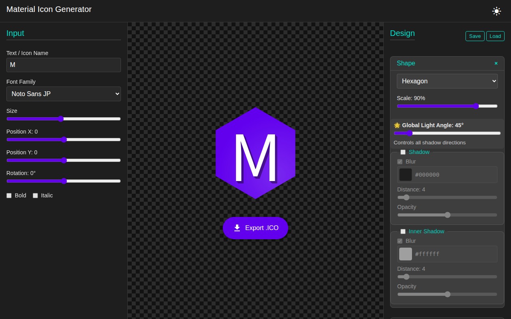

# IcoGen - Material Icon Generator

A powerful, local-first web application for generating Material Design-style icon images with advanced visual effects and multi-sized PNG export capabilities.



## ✨ Features

### 🎨 Rich Design Controls

- **Shape Variations**: Circle, Square, Rounded Square, Rectangle, Rounded Rectangle, Triangle, Rounded Triangle, Hexagon, Rounded Hexagon, Diamond, Rounded Diamond
- **Character Catalog**: Visual picker for selecting special characters, symbols, and emojis directly from the font
- **Advanced Text Styling**: Position control (X/Y), Rotation (-180° to 180°), bold, italic, variable font size
- **Noto Font Suite**: Full integration with Noto Sans JP, Noto Serif JP, Noto Symbols, Noto Sans Symbols 2, Noto Music, Noto Emoji, and more
- **Color Customization**: Background colors, gradient overlays, text gradients

### 🌟 Advanced Effects

- **Surface & Lighting (Material Design)**:
  - **Finish Layer**: Glossy surface finish with adjustable opacity
  - **Edge Treatment**: Tint and Shade effects for 3D depth
  - **Score Effect**: Realistic fold/crease illusion for shapes
  - **Auto Color Harmony**: Automatically generates harmonious tint/shade values based on background color
- **Shadow Effects**:
  - **Unified Global Light Source**: Control all shadow and gradient angles with a single slider for Material Design consistency
  - **Smart Clipping**: Shadows are correctly contained within the shape boundaries
  - **Rotation-aware**: Shadow direction respects global light source regardless of text rotation
  - Drop Shadow with blur control
  - Long Shadow with customizable length and fade
  - Shape Shadow with distance controls
  - Inner Shadow for shapes
- **Text Effects**:
  - Outline with adjustable width and opacity
  - Gradient overlay synced with global light source
  - Multi-layered shadow effects (Drop & Long)

### 💾 Export & Configuration

- **Multi-Size Export**: Generate .ICO files with multiple resolutions
- **Save/Load Settings**: Export and import all design settings as JSON
- **Real-time Preview**: Live preview canvas with instant visual feedback

### 🎯 User Interface

- **3-Pane Layout**:
  - **Left Pane**: Input controls (text, font, styling)
  - **Center Pane**: Real-time preview canvas
  - **Right Pane**: Advanced design controls (collapsible sections)
- **Modern Design**: Clean, intuitive interface with Material Design aesthetics

## 🚀 Getting Started

### Prerequisites

- Node.js (v14 or higher)
- npm or yarn

### Installation

```bash
# Clone the repository
git clone https://github.com/YOUR_USERNAME/icogen.git
cd icogen

# Install dependencies
npm install

# Start development server
npm run dev
```

The application will be available at `http://localhost:5173`

### Building for Production

```bash
npm run build
npm run preview
```

## 📖 Usage

1. **Enter Text/Icon Name**: Type your text or icon name in the left pane
2. **Select Font**: Choose from the Noto font family collection
3. **Customize Design**: Adjust shape, colors, and effects in the right pane
4. **Preview**: View real-time changes in the center canvas
5. **Export**: Click the "Export .ICO" button to download your icon

### Saving and Loading Configurations

- Click **Save** to export all current settings as a JSON file
- Click **Load** to import previously saved settings
- Share your configurations with others!

## 🏗️ Project Structure

```text
icogen/
├── index.html          # Main HTML structure with 3-pane layout
├── package.json        # Project dependencies and scripts
├── public/             # Static assets
│   └── vite.svg       # Vite logo
└── src/                # Source code
    ├── main.js         # Application entry point
    ├── state.js        # State management
    ├── renderer.js     # SVG rendering and effects
    ├── exporter.js     # ICO file generation
    ├── ui.js           # UI event handlers
    └── style.css       # Application styles
```

## 🛠️ Technology Stack

- **Vite**: Fast build tool and development server
- **Vanilla JavaScript**: Pure JavaScript, no framework dependencies
- **SVG**: Scalable vector graphics for rendering
- **Canvas API**: For image export functionality
- **Noto Fonts**: Comprehensive font coverage via Google Fonts

## 🎓 Development Notes

### Code Generation

> [!IMPORTANT]
> **This entire project was generated using Google's Antigravity AI assistant.**
>
> All code, from the initial setup to the advanced features, was created through conversational prompts with Antigravity. This demonstrates the power of AI-assisted development for rapid prototyping and full-stack application creation.

The project serves as a showcase of:

- AI-generated web application architecture
- Premium UI/UX design principles
- Complex visual effects implementation
- Local-first application development

### Key Design Principles

1. **No Placeholders**: All functionality is fully implemented
2. **Premium Aesthetics**: Modern, visually appealing interface
3. **Rich Interactions**: Smooth animations and responsive controls
4. **Component Architecture**: Modular, maintainable code structure

## 📄 License

MIT License - Feel free to use this project for personal or commercial purposes.

## 🤝 Contributing

Contributions are welcome! Please feel free to submit a Pull Request.

## 🙏 Acknowledgments

- **Google Antigravity**: AI assistant that generated this entire codebase
- **Material Design**: Design inspiration and guidelines
- **Noto Fonts**: Comprehensive font support from Google Fonts
- **Vite**: Lightning-fast development experience

---

**Made with 🤖 by [Antigravity](https://deepmind.google/technologies/gemini/) - Google's Advanced Agentic AI Coding Assistant**
